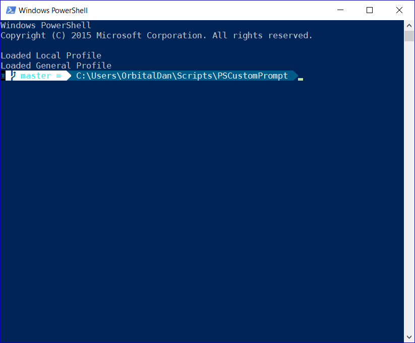

# PSCustomPrompt
I recently discovered the [Oh-My-Zsh project](http://ohmyz.sh/), 
and was inspired by the [styles of the themes available for 
it](https://github.com/robbyrussell/oh-my-zsh/wiki/themes).
Of particular interest was the theme [agnoster](https://github.com/robbyrussell/oh-my-zsh/wiki/themes#agnoster)
which uses the [powerline project](https://github.com/powerline) to 
inject all manner of useful information into the prompt and a
rendered statusbar.  I decided I wanted to try to replicate
some of the slick appearance (if not the functionality) of that
within PowerShell!  

As luck would have it, one of the missing
pieces [has just been added in Windows 10 v1511](http://www.nivot.org/blog/post/2016/02/04/Windows-10-TH2-%28v1511%29-Console-Host-Enhancements),
under the unassuming name of "Console Host Enhancements".
Specifically, the windows console can now process ANSI/VT100
terminal control codes, albeit with some limitations.  By installing
a [font patched with the powerline symbols](https://github.com/powerline/fonts)
and [making it available for use in the console](http://www.techrepublic.com/blog/windows-and-office/quick-tip-add-fonts-to-the-command-prompt/),
I was able to produce a similarly nice looking prompt in
PowerShell:

It takes a bit of prep work:

1) Install a [powerline patched font](https://github.com/powerline/fonts).
I used DejaVu Sans Mono for Powerline.

2) [Create a REG_SZ subkey](http://www.techrepublic.com/blog/windows-and-office/quick-tip-add-fonts-to-the-command-prompt/)
in "HKEY_LOCAL_MACHINE\SOFTWARE\Microsoft\Windows NT\CurrentVersion\Console\TrueTypeFont".
The name should be composed of zeroes (i.e. '000') and the value is the name
of the font you installed in step 1, as reported by Character Map.

3) Re-login or reboot to apply the changes.

4) Select the font in the properties dialog for the powershell
console, and edit the DarkCyan color (fourth box from the left
in the color tab) to a nicer shade.  I used RGB(0,90,135) to
get the result in the screenshot.  Note that you have to select
DarkCyan before you can edit it, so take note of the color that
was selected first, and re-select it after editing.
If you ever need the original DarkCyan back, it's RGB(0,128,128).

5) Dot-source the included script (CustomPrompt.ps1) either live
or in your profile to see the effects for yourself!  I included
a function to switch out the symbol at the front, but this is really
just a cosmetic ability for now.
